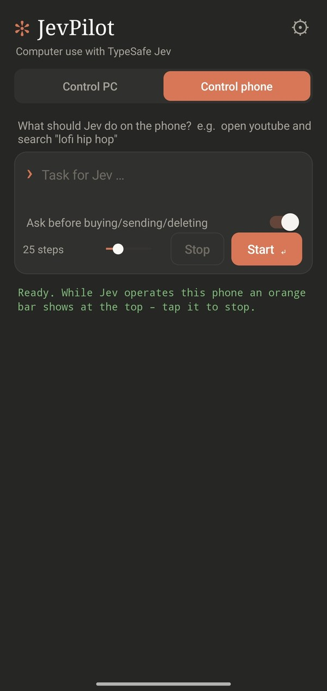

# Android app



The app has two tabs:
- **Control PC** sends tasks to JevPilot on your PC and shows its log live.
- **Control phone** lets Jev operate the phone itself.

## Install (Android 11+)
1. Download `JevPilot-Android.apk` from the [releases](../../../releases/latest) to your phone.
2. Open the file and allow installing from this source.
3. Open JevPilot and paste your TypeSafe API key. The key is stored only on the phone.

## Set up "Control phone"
Jev reads the screen through an Android **accessibility service** and taps for you.
1. In the "Control phone" tab, tap **Enable**.
2. Go to Accessibility → Installed apps (or Downloaded apps) → **JevPilot** and turn it on.
3. If Android shows **"Restricted setting"**:
   1. Go to Settings → Apps → JevPilot → ⋮ (top right) → **Allow restricted settings**.
   2. Turn the accessibility service on again.

While Jev is working, an **orange bar** shows at the top of the screen. Tap it to stop Jev immediately. Before a risky action (sending, buying, calling, deleting), a card asks you to confirm.

## Pair with your PC
1. On the PC, open JevPilot → **⚙ Settings**. It shows the **PC address** (e.g. `192.168.178.20:8765`) and the **pairing code**.
2. In the phone app, enter both under **⚙**.
3. Your phone and PC must be on the **same Wi-Fi**.
4. The first time, Windows Firewall asks for access. Allow JevPilot on **private networks**.

You can also connect over USB without Wi-Fi. This needs USB debugging (Developer options):
```
adb reverse tcp:8765 tcp:8765
```
The app then tries `127.0.0.1:8765` automatically.

Once everything works, the tab shows **● Connected to <PC name>**.
