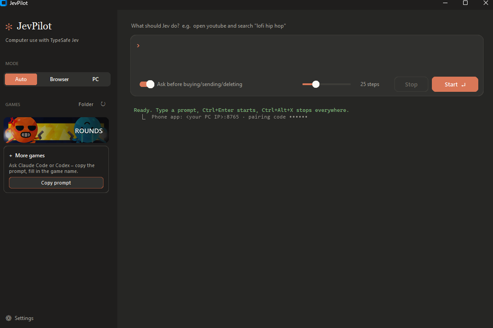

# Windows app

## Install
1. Download `JevPilot-Windows.zip` from the [releases](../../../releases/latest) and unzip it.
2. Right-click `install.ps1` → **Run with PowerShell**.
   - JevPilot is installed to `%LOCALAPPDATA%\Programs\JevPilot`.
   - A Start menu entry is added, so you can find JevPilot in Windows search.
   - No admin rights needed.
3. Start **JevPilot** and paste your TypeSafe API key. The app won't start without one.

> Windows SmartScreen may warn you because the exe isn't code-signed. If it does, click **More info** → **Run anyway**.

Requirements: Windows 10/11 and Microsoft Edge (preinstalled on most PCs). JevPilot uses Edge to control the browser.

## Usage
| Element | What it does |
|---|---|
| **Mode** | **Auto**: Jev decides. **Browser**: uses a separate Edge profile. **PC**: works in Windows programs. |
| **Prompt box** | The task, e.g. `open youtube and search "lofi hip hop"`. Jev types text in quotes exactly as written. `Ctrl+Enter` starts. |
| **Ask before buying/sending/deleting** | Jev asks before risky actions, on the PC and in the phone app. |
| **Steps** | Maximum number of actions per task. |
| **Games** | Pick a game, then press Start. See [Games](games.md). |
| **⚙ Settings** | Change the API key. Also shows the PC address and pairing code for the phone app. |

**Stop anytime:** `Ctrl+Alt+X`. While Jev controls the PC, an orange bar at the top shows what it's doing.

## Where your data is stored
| File | Contents |
|---|---|
| `%APPDATA%\JevPilot\config.json` | API key and pairing code, stored locally only |
| `%LOCALAPPDATA%\JevPilot\browser-profile` | JevPilot's Edge profile, separate from your normal Edge |

## Uninstall
Delete `%LOCALAPPDATA%\Programs\JevPilot`, `%APPDATA%\JevPilot` and the Start menu entry `JevPilot`.
